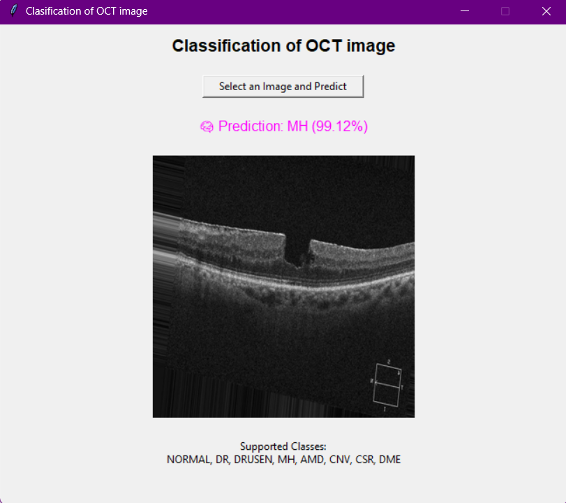

# OCT Image Disease Classification Using Deep Learning

This project aims to classify retinal diseases from OCT (Optical Coherence Tomography) images using deep learning. It includes both model training and a graphical user interface (GUI) for making predictions on new images.

---

## Dataset

The dataset used in this project is from **Kaggle**:

🔗 **[Retinal OCT Images (optical coherence tomography)](https://www.kaggle.com/datasets/obulisainaren/retinal-oct-c8)**

It contains 8 classes of retinal conditions:

- NORMAL
- DR (Diabetic Retinopathy)
- DRUSEN
- MH (Macular Hole)
- AMD (Age-related Macular Degeneration)
- CNV (Choroidal Neovascularization)
- CSR (Central Serous Retinopathy)
- DME (Diabetic Macular Edema)

All images are resized to **128x128** and converted to grayscale.

---

## Model

The model is a Convolutional Neural Network (CNN) with the following architecture:

- Conv2D (32 filters) + ReLU + MaxPooling
- Conv2D (64 filters) + ReLU + MaxPooling
- Flatten + Dense (64 units) + Output layer (Softmax)

Training settings:

- **Loss Function**: `sparse_categorical_crossentropy`
- **Optimizer**: `Adam`
- **Metrics**: `accuracy`
- **Epochs**: 10
- **Batch Size**: 32

The best model is saved as `best_model.h5`.

---

## GUI Application

The GUI is built using **Tkinter** and allows users to:

- Upload an OCT image
- Automatically classify it into one of 8 disease categories
- Display the prediction and confidence score
- View the selected image inside the application

### Supported Image Formats:
- `.jpg`, `.jpeg`, `.png`

---

## How to Run the Project

1. Clone the repository:
   ```bash
   git clone https://github.com/your-username/oct-disease-classification.git
   cd oct-disease-classification
2. Install the dependencies:
   ```bash
   pip install -r requirements.txt
3. Train the model:
   ```bash
   python model_train.py
4. Run the GUI:
   ```bash
   python gui_predictor.py

## Requirements:

-Python 3.x
-TensorFlow
-NumPy
-OpenCV
-Pillow
-scikit-learn
-Tkinter (included with most Python installations)

 
 ## GUI Screenshot


## Contributing
Contributions are welcome! Please open an issue or submit a pull request if you have suggestions or improvements.


